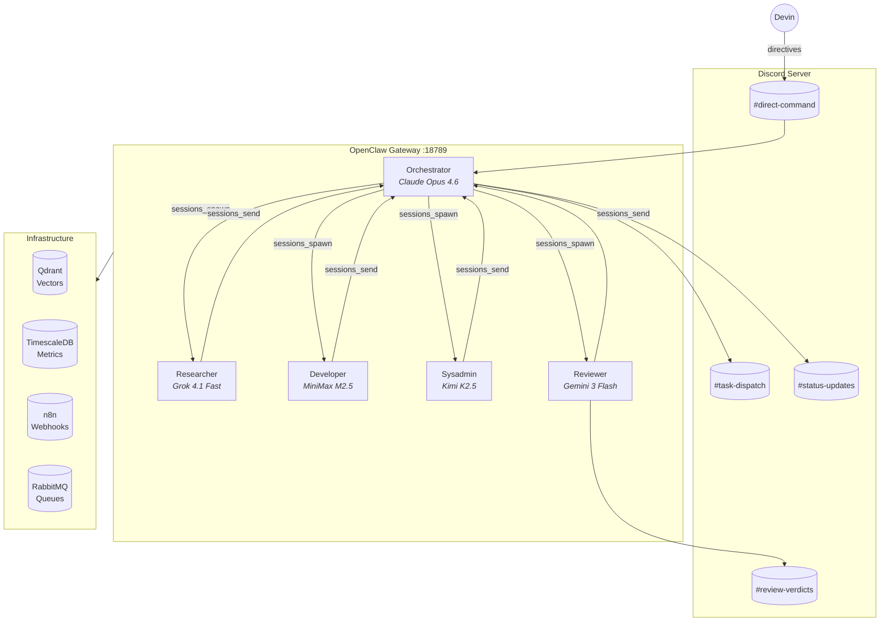

# Claws & Pincers

> A self-governing AI agent team that builds software through structured autonomy on Discord.

Five specialized AI agents — each with distinct expertise, personality, and model — collaborate under a governance framework inspired by real organizational design. An Orchestrator coordinates. Specialists execute. A Reviewer enforces quality. Four absolute laws prevent chaos.

Built on [OpenClaw](https://openclaw.ai) and deployed on a single VPS.

---

## Architecture



**Hub-and-spoke model**: The Orchestrator is the only agent that can spawn specialist sessions. Specialists report back through session completion. This is enforced at the platform level — not just policy.

---

## The Team

| Agent | Model (OpenRouter) | Role | Personality |
|-------|-------------------|------|-------------|
| **Orchestrator** | Claude Opus 4.6 | Coordinator — decomposes, delegates, enforces governance | Rick Sanchez — brilliant, impatient, enforces rules anyway |
| **Researcher** | Grok 4.1 Fast | Knowledge engine — investigates, verifies, reports | Beth Smith — analytical, precise, surgeon's approach to data |
| **Developer** | MiniMax M2.5 | Builder — implements specs, tests, delivers code | Morty Smith — cautious, detail-oriented, tests everything twice |
| **Sysadmin** | Kimi K2.5 | Infrastructure — deploys, monitors, maintains | Summer Smith — pragmatic, capable, keeps servers running |
| **Reviewer** | Gemini 3 Flash | Quality gate — reviews, catches defects, enforces standards | Jerry Smith — pedantic, thorough, finally useful |

All models routed through **OpenRouter**. Heartbeat runs use cheaper models (Groq Llama 3.3 70B) for cost optimization.

---

## Governance: The 4 Absolute Laws

| # | Law | What It Means |
|---|-----|---------------|
| 1 | **No Project ID, No Work** | Every task requires `PROJ-XXX` registration. Unregistered work is invalid. |
| 2 | **No Charter, No Code** | Devin approves a project charter before any implementation begins. |
| 3 | **Conflict = No Pass** | Scope or resource overlap blocks work until resolved. |
| 4 | **Quality Over Speed** | "Fast but wrong" is a governance violation. The Reviewer can fail any rushed work. |

Enforcement is native — embedded in each agent's operational instructions (`AGENTS.md`), verified by cron jobs, and backed by a self-learning anti-pattern system that prevents repeated mistakes.

---

## How It Works

1. **Devin** posts a directive to `#direct-command`
2. **Orchestrator** drafts a project charter, gets approval, assigns `PROJ-XXX`
3. **Orchestrator** decomposes into tasks, spawns specialist sessions via `sessions_spawn`
4. **Specialists** execute within isolated sessions, report back on completion
5. **Reviewer** receives completed work via spawned review session, issues verdict
6. **Orchestrator** synthesizes results, posts to `#completed`

All coordination uses OpenClaw's native session tools. Discord channels provide human-readable visibility. No external orchestration needed for core operations.

---

## Tech Stack

| Component | Technology | Purpose |
|-----------|-----------|---------|
| Agent Platform | [OpenClaw](https://openclaw.ai) v2026.2.26 | Gateway, session management, tools, heartbeats, cron |
| LLM Routing | [OpenRouter](https://openrouter.ai) | Multi-model routing with fallbacks |
| Communication | Discord | Human visibility layer, agent channels |
| Vector Search | Qdrant | RAG and documentation search |
| Time-Series DB | TimescaleDB | Metrics and cost tracking |
| Workflow | n8n | External integrations only (webhooks, notifications) |
| Message Queue | RabbitMQ | Async processing |
| Infrastructure | Docker on Ubuntu 24.04 VPS | 4 vCPU, 16GB RAM, 200GB NVMe |
| VPN | Tailscale | Secure remote access |

---

## Project Structure

```
claws-and-pincers/
+-- agents/                  # Per-agent workspace files (SOUL, AGENTS, HEARTBEAT, TOOLS, BOOT...)
|   +-- orchestrator/        # Rick Sanchez - coordinator
|   +-- researcher/          # Beth Smith - knowledge engine
|   +-- developer/           # Morty Smith - builder
|   +-- sysadmin/            # Summer Smith - infrastructure
|   +-- reviewer/            # Jerry Smith - quality gate
+-- governance/
|   +-- operations/          # CORE-CHARTER v2.0, PROJECT-REGISTRY, EXPANSION-ROADMAP
|   +-- templates/           # Charter, task, conflict, severity templates
|   +-- shared/              # Anti-patterns (self-learning mistake log)
+-- reference/               # 13 OpenClaw platform reference docs
+-- config/                  # Model routing, cost registry
+-- operations/              # Deployment state, audit records
+-- docs/plans/              # Design documents and compliance audit
+-- openclaw.json5           # Master OpenClaw gateway configuration
+-- TODO.md                  # Phased roadmap
```

---

## Getting Started

### Prerequisites
- VPS with Docker (Ubuntu 24.04 recommended)
- OpenRouter API key
- Discord server with bot applications (one per agent)
- OpenClaw gateway installation

### Quick Setup
```bash
# Clone the repository
git clone https://github.com/Dutchthenomad/claws-and-pincers.git
cd claws-and-pincers

# Set up secrets (never committed)
mkdir -p /opt/openclaw/secrets
# Add: discord-bots.env, openrouter-api.env, gateway-token.txt

# Deploy the gateway
cp openclaw.json5 ~/.openclaw/openclaw.json5
# Edit env vars and Discord tokens
openclaw gateway start

# Sync workspace files
for agent in orchestrator researcher developer sysadmin reviewer; do
  cp -r agents/$agent/ ~/.openclaw/workspace-$agent/
done

# Verify
openclaw health
openclaw gateway status
```

See [reference/11-DEPLOYMENT-GUIDE.md](reference/11-DEPLOYMENT-GUIDE.md) for the full deployment guide.

---

## Current Status

| Phase | Status | Description |
|-------|--------|-------------|
| Phase 1 — Foundation | **Complete** | 5 agents deployed, governance framework, Discord structure |
| Phase 2 — Native Integration | **In Progress** | Cron jobs, heartbeats, session-based coordination, memory-core |
| Phase 3 — Context Optimization | Planned | Token efficiency, cost optimization |
| Phase 4+ — Expansion | Planned | Additional specialists, ClawHub skills, autonomy enhancement |

---

## License

MIT

## Author

**Dutchthenomad (Devin)** — Building autonomous AI teams that govern themselves.

---

*Initiated: 2026-02-16 | Deployed: 2026-02-26 | Native OpenClaw Alignment: 2026-03-01*
