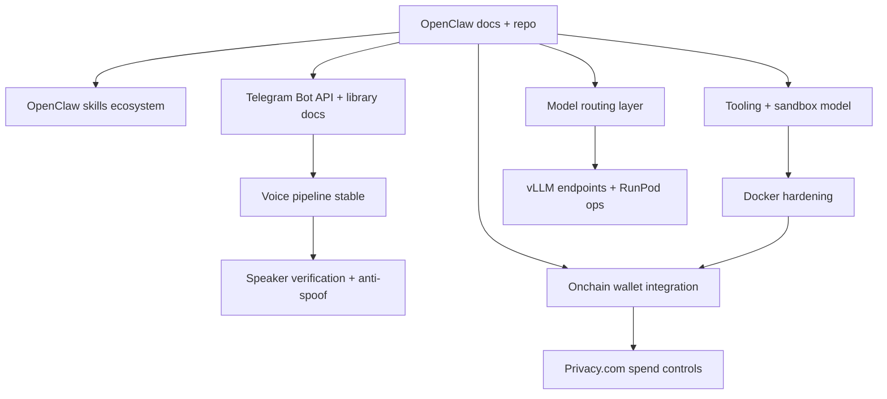

# OpenClaw RAG "Gold Standard" Source Inventory (Jan 31, 2026)

> **Research Agent**: ChatGPT 5.2
> **Purpose**: Gold standard reference list for RAG knowledge sourcing

---

## Executive Summary (1 page)

Your highest-leverage move is to ingest P0 OpenClaw docs + repo + skills ecosystem, then P0 Telegram Bot API (voice + webhooks + limits). Those two unlock the agent's actual operational surface area (tools, skills, sandboxing, approvals, channel I/O). Everything else becomes "nice" but not "necessary" until the assistant can reliably act and remember.

OpenClaw is public and actively maintained (docs + GitHub org + frequent releases).

Chunking defaults (your stack): 256–512 tokens, 50–100 overlap, header-aware + code-block-aware, preserve metadata: source_url, section_path, doc_type, retrieved_at.

---

## P0 Domains (Critical Path)

### 1) domain: OpenClaw Platform

priority: P0
current_state: NOT indexed (per your inventory)

Core sources (public, canonical):

**url: https://docs.openclaw.ai/**

- type: docs
- pages_or_sections:
  - Tools (Exec Tool, Web Tools, apply_patch, Elevated Mode)
  - Plugins (Voice Call Plugin, channel plugins)
  - Browser (managed browser, login, troubleshooting)
  - Multi-Agent Sandbox & Tools, Sub-Agents
  - Skills (authoring, loading, marketplace)
  - CLI / gateway (gateway config, ops)
- estimated_chunks: 350–700
- notes: This is your "operational bible." Ingest by nav tree; keep section path tags.

**url: https://github.com/openclaw/openclaw**

- type: github
- pages_or_sections:
  - README + docs folder (install, config, channel setup)
  - Gateway control-plane details (routing, sessions, tools)
- estimated_chunks: 150–300
- notes: Ingest README + /docs + config examples first.

**url: https://github.com/orgs/openclaw/repositories**

- type: github
- pages_or_sections:
  - skills repo (archived skill versions; marketplace mirror)
  - nix-openclaw (deployment packaging patterns)
- estimated_chunks: 80–160
- notes: Great for "how people actually deploy this."

**url: https://github.com/cloudflare/moltworker**

- type: github
- pages_or_sections:
  - persistence patterns (backup/restore, cron sync)
- estimated_chunks: 40–80
- notes: Concrete patterns for memory/config persistence on container startup.

**url: https://github.com/VoltAgent/awesome-openclaw-skills**

- type: github
- pages_or_sections:
  - curated skills list + ecosystem patterns
- estimated_chunks: 30–60
- notes: Crowd-consensus "what to install."

**ingestion_strategy:**
- chunk_size: 512
- chunk_overlap: 80
- metadata_tags: [openclaw, gateway, tools, skills, plugins, sandbox, channels, persistence]

**dependencies:**
- Ingest OpenClaw docs before any skills repos (you'll understand contracts and lifecycles).
- Ingest gateway/CLI before hardening work (security depends on runtime behavior).

**verification:**
- Spin up assistant + Telegram channel; confirm: tool registry loads, skills discoverable, memory persists across restart, elevated actions require tiered approval.

---

### 2) domain: Telegram Bot API (voice-first ops)

priority: P0
current_state: NOT indexed

**sources:**

**url: https://core.telegram.org/bots/api**

- type: api-ref
- pages_or_sections:
  - Update, Message, Voice, Audio, Document objects
  - getFile / file_path lifecycle
  - Webhooks vs long polling
  - InlineKeyboardMarkup + callbacks
  - Local Bot API server capabilities (2GB upload, unlimited downloads)
- estimated_chunks: 250–450
- notes: Ingest "object model" + file handling + webhook setup as separate chunk groups.

**url: https://core.telegram.org/bots/features**

- type: docs
- pages_or_sections:
  - keyboards, commands, deep linking
- estimated_chunks: 60–120

**url: https://core.telegram.org/bots/faq**

- type: docs
- pages_or_sections:
  - file size limits, persistence of file_id
- estimated_chunks: 30–60
- notes: The 50MB send limit and ~20MB download behavior via getFile show up here.

**url: https://docs.python-telegram-bot.org**

- type: docs
- pages_or_sections:
  - filters + MessageHandler patterns (voice routing)
  - webhook deployment notes
- estimated_chunks: 120–220
- notes: Keep version tags; library APIs change.

**url: https://docs.aiogram.dev**

- type: docs
- pages_or_sections:
  - file download flow (get_file → download_file)
  - getFile 20MB note + file link lifetime
- estimated_chunks: 120–220
- notes: aiogram docs explicitly note getFile limits and the 1-hour URL validity.

**ingestion_strategy:**
- chunk_size: 384–512
- chunk_overlap: 80
- metadata_tags: [telegram, bot-api, voice, webhooks, callbacks, rate-limits, file-handling]

**dependencies:**
- Telegram API + library docs before voice biometrics (you need reliable audio capture + storage).

**verification:**
- Voice message round-trip: receive → download → store → transcode (optional) → run verification.

---

## P1 Domains (Enhanced Capabilities)

### 3) domain: Voice Biometric Authentication (speaker verification + anti-spoof)

priority: P1
current_state: Only TTS indexed; no speaker verification

**sources:**

| URL | Type | Chunks | Notes |
|-----|------|--------|-------|
| https://speechbrain.readthedocs.io/ | docs | 80–160 | speechbrain.inference.speaker.SpeakerRecognition, verification APIs |
| https://github.com/speechbrain/speechbrain | github | 60–140 | pretrained speaker-recognition recipes |
| https://arxiv.org/pdf/2106.04624 | paper | 20–40 | system overview + design rationale |
| https://github.com/resemble-ai/Resemblyzer | github | 40–80 | embeddings + similarity thresholds |
| https://huggingface.co/pyannote | docs | 60–120 | speaker diarization + embeddings |
| https://www.asvspoof.org/ | docs/papers | 40–90 | anti-spoof evaluation sets |

**Opinionated pick for <2s latency**: SpeechBrain speaker verification is the most "docs + OSS maturity" combo; Resemblyzer is simpler but less "batteries included."

---

### 4) domain: Crypto wallet integration (Base + USDC transfers)

priority: P1
current_state: NOT indexed

**sources:**

| URL | Type | Chunks | Notes |
|-----|------|--------|-------|
| https://docs.base.org/base-chain/quickstart/connecting-to-base | docs | 30–60 | chain IDs, RPCs, explorers |
| https://docs.base.org/base-chain/network-information/transaction-finality | docs | 30–60 | finality model + flashblock |
| https://www.circle.com/blog/usdc-now-available-natively-on-base | blog | 10–20 | native USDC support |
| https://basescan.org/token/0x833589fCD6eDb6E08f4c7C32D4f71b54bdA02913 | explorer | 10–20 | contract + decimals (6) |
| https://basescan.org/gastracker | explorer | 5–10 | current gas |
| https://docs.ethers.org/v6/ | docs | 120–220 | signing, providers, contracts |
| https://viem.sh/docs | docs | 120–220 | wallet clients, ERC-20 |

**Current metrics**: Base gas tracker shows sub-cent "<$0.01" estimates.

---

### 5) domain: vLLM deployment (RunPod + OpenAI-compatible serving)

priority: P1
current_state: RunPod indexed; vLLM may be incomplete

**sources:**

| URL | Type | Chunks | Notes |
|-----|------|--------|-------|
| https://docs.vllm.ai/en/stable/serving/openai_compatible_server/ | docs | 60–120 | vllm serve, API compatibility |
| https://github.com/vllm-project/vllm | github | 80–160 | examples, engine args, tensor parallelism |
| https://www.runpod.io/blog/run-larger-llms-on-runpod-serverless-than-ever-before | blog | 10–20 | FlashBoot + cold-start claims |
| https://www.runpod.io/articles/guides/best-docker-image-vllm-inference-cuda-12-4 | guide | 15–30 | bake weights vs volume caching |

**RunPod cold start reality**: FlashBoot claim "~600ms" possible with correct caching for 70B. Community reports show long cold starts when weights re-download (order of minutes) if caching is misconfigured.

---

### 6) domain: Current SOTA ablated/uncensored models (Jan 2026 landscape)

priority: P1
current_state: method indexed; model-specific coverage limited

**sources:**

| URL | Type | Chunks | Notes |
|-----|------|--------|-------|
| https://huggingface.co/collections/failspy/abliterated-v3 | model-collection | 40–80 | top models (70B/8B variants) |
| https://huggingface.co/failspy/Meta-Llama-3-8B-Instruct-abliterated-v3 | model-card | 20–40 | methodology summary |
| https://huggingface.co/dphn/dolphin-2.6-mixtral-8x7b | model-card | 20–40 | behavior notes |
| https://huggingface.co/cognitivecomputations | org | 60–140 | Dolphin family releases |

---

### 7) domain: Anthropic API completeness check

priority: P1
current_state: cookbook indexed; verify "full API surface"

**sources:**

| URL | Type | Chunks | Notes |
|-----|------|--------|-------|
| https://platform.claude.com/docs/en/about-claude/pricing | docs | 10–20 | tool token accounting |
| https://docs.anthropic.com/en/api | docs | 80–160 | Messages API, streaming, errors |
| https://docs.anthropic.com/en/docs/build-with-claude/tool-use | docs | 40–80 | tool use patterns |

---

## P2 Domains (Operational Excellence)

### 8) domain: Docker security hardening (seccomp/AppArmor/caps)

priority: P2
current_state: limited

**sources:**

| URL | Type | Chunks | Notes |
|-----|------|--------|-------|
| https://cheatsheetseries.owasp.org/cheatsheets/Docker_Security_Cheat_Sheet.html | docs | 60–120 | PRIORITY - actionable guidance |
| https://docs.docker.com/engine/security/ | docs | 60–120 | namespaces, capabilities |
| https://www.cisecurity.org/benchmark/docker | benchmark | 80–140 | CIS Docker Benchmark PDF |

---

### 9) domain: Privacy.com / virtual cards

priority: P2
current_state: NOT indexed

**sources:**

| URL | Type | Chunks | Notes |
|-----|------|--------|-------|
| https://privacy-com.readme.io/docs/getting-started | docs | 20–40 | auth, API basics |
| https://privacy-com.readme.io/docs/cards | docs | 40–80 | card create/update, limits |
| https://privacy-com.readme.io/docs/webhooks | docs | 20–40 | transaction webhooks |

---

## Model Routing Patterns — Recommended Knowledge Layer

**url: https://docs.litellm.ai/docs/routing**

- type: docs
- pages_or_sections: routing strategies (rate-limit aware, latency/cost based)
- estimated_chunks: 40–80

This directly matches your "multi-model routing config" goal without reinventing a routing control-plane.

---

## Consolidated Source Index (URLs)

**P0**: docs.openclaw.ai, github.com/openclaw/openclaw, openclaw org repos, cloudflare/moltworker, awesome-openclaw-skills, core.telegram.org/bots/api, bots/features, bots/faq, python-telegram-bot docs, aiogram docs

**P1**: SpeechBrain docs + repo + paper, Resemblyzer, pyannote, ASVspoof, Base docs (connecting + finality), Circle blog, BaseScan USDC token page + gas tracker, ethers v6, viem docs, vLLM docs + repo, RunPod FlashBoot blog + vLLM image guide, failspy collection + model cards, Cognitive Computations HF org, Anthropic API docs + pricing

**P2**: OWASP Docker cheat sheet, Docker security docs, CIS Docker benchmark landing/PDF, Privacy.com API docs

---

## Dependency Graph (mermaid)

---

## Verification Checklist (minimum viable "it works")

- [ ] Assistant replies in Telegram reliably; voice messages captured + stored
- [ ] Tools registry loads; elevated actions demand tier approval
- [ ] Memory persists across restarts
- [ ] vLLM endpoint responds via OpenAI-compatible client; streaming OK
- [ ] Base: can query gas + build ERC-20 transfer; USDC contract confirmed
- [ ] Container hardening applied without breaking core features

---

## Open Questions & Recommendations

| Question | Answer |
|----------|--------|
| OpenClaw availability | Yes—public docs + public GitHub + recent releases |
| Best OSS speaker verification for <2s | Start with SpeechBrain; benchmark vs Resemblyzer |
| Routing framework | LiteLLM Router is the cleanest option |
| RunPod cold start | FlashBoot can be fast; misconfigured caching explodes to minutes |
| Base gas costs | Track via BaseScan gas tracker snapshots |

**Next step**: Turn this into an execution-ready ingestion queue with crawler plan per source: URL patterns, recursion depth, exclude rules, and metadata schema.

---

*Research completed: 2026-01-31 by ChatGPT 5.2*
