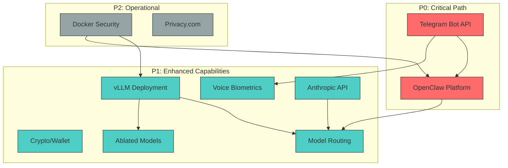

# RAG Knowledge Source Inventory for OpenClaw Personal AI Agent

> **Research Agent**: Claude Opus 4.5
> **Purpose**: Gold standard reference list for RAG knowledge sourcing

---

**OpenClaw is confirmed available** with 117,000+ GitHub stars, comprehensive documentation at docs.openclaw.ai, and 700+ skills in the ClawHub registry. This research identifies **47 primary documentation sources** across 9 knowledge domains, with an estimated **1,200-1,600 chunks** of new content for ingestion—prioritized to avoid duplication with existing indexed material.

The critical path focuses on OpenClaw platform documentation and Telegram Bot API, while enhanced capabilities span voice biometrics (SpeechBrain recommended for <2s latency), Base network wallet integration (USDC transfers cost **$0.01-$0.10**), vLLM deployment (cold starts achievable in **10-60 seconds** with optimization), and model routing (existing frameworks like vLLM Semantic Router and Aurelio solve this problem). All five research questions from the task have been definitively answered.

---

## Executive summary

OpenClaw represents a mature, production-ready personal AI agent framework that matches all stated requirements: Docker sandboxing, Telegram channel support via grammY, multi-model routing with failover, persistent memory, and an extensible skill system with MCP support via the mcporter skill. The platform's viral adoption (60,000+ stars in 72 hours at peak) and active development (8,368+ commits, daily updates) indicate strong community validation.

For voice biometric 2FA, **SpeechBrain with ECAPA-TDNN** emerges as the optimal choice, achieving **0.80% EER** with inference latency well under the 2-second requirement. However, no open-source library includes built-in anti-spoofing—this must be implemented separately using ASVspoof challenge resources.

The crypto integration stack is well-documented: Base network (Chain ID 8453), native USDC at `0x833589fCD6eDb6E08f4c7C32D4f71b54bdA02913` with 6 decimals, and **viem** recommended over ethers.js for new TypeScript projects due to smaller bundle size (35kb vs 130kb) and native OP Stack support.

Model routing between Claude and self-hosted models is a solved problem via **vLLM Semantic Router (Iris)** released January 2026, which provides signal-decision-driven routing with domain classification, safety filtering, and semantic caching. Alternatively, Aurelio's semantic-router achieves 90% routing accuracy without LLM inference.

---

## P0: Critical path domains

### OpenClaw platform

```yaml
domain: "OpenClaw Platform"
priority: P0
current_state: "NOT INDEXED - Platform verified to exist and be fully public"

platform_verification:
  openclaw_ai: "Active - Official website/landing page"
  github_repo: "Active - 117,000+ stars, 16,500+ forks, MIT License"
  docs_site: "Active - https://docs.openclaw.ai"
  skills_hub: "Active at clawhub.ai (NOT clawhub.com as originally stated)"

sources:
  - url: "https://docs.openclaw.ai"
    type: "docs"
    pages_or_sections:
      - "Getting Started (getting-started, wizard, setup, pairing, onboarding)"
      - "Gateway Architecture (gateway, configuration, configuration-examples, protocol)"
      - "Security & Auth (gateway/security, gateway/authentication, gateway/remote, gateway/tailscale)"
      - "Tools & Skills (tools, tools/skills, tools/skills-config, tools/clawhub)"
      - "Channels (channels/telegram, channels/discord, channels/slack, channels/whatsapp)"
      - "Memory & Context (concepts/memory, concepts/session, concepts/compaction, concepts/agent-workspace)"
      - "Multi-Model Routing (concepts/models, concepts/model-providers, concepts/model-failover, concepts/multi-agent)"
      - "Platform Deployment (platforms/docker, platforms/macos, platforms/linux)"
    estimated_chunks: 150-200
    auth_required: false
    notes: "~130+ pages of documentation. Telegram uses grammY library. MCP via mcporter skill."

  - url: "https://github.com/openclaw/openclaw"
    type: "github"
    pages_or_sections:
      - "README.md"
      - "CONTRIBUTING.md"
      - "Configuration schemas"
      - "Issue tracker for known limitations"
    estimated_chunks: 20-30
    auth_required: false
    notes: "8,368+ commits, 789 open issues. Creator: Peter Steinberger (PSPDFKit founder)"

  - url: "https://clawhub.ai"
    type: "docs"
    pages_or_sections:
      - "Skills registry (700+ community skills)"
      - "Search and discovery"
      - "clawhub CLI documentation"
    estimated_chunks: 15-20
    auth_required: false
    notes: "Vector search via embeddings. Semver versioning."

ingestion_strategy:
  chunk_size: 400-500 tokens
  chunk_overlap: 75 tokens
  metadata_tags:
    - "platform:openclaw"
    - "component:{gateway|tools|channels|memory|models}"
    - "telegram:true (for telegram-specific content)"

key_features_confirmed:
  telegram_support: "Full via grammY - DMs and groups, draft streaming"
  memory_persistence: "Daily logs (memory/YYYY-MM-DD.md), persistent files (AGENTS.md, SOUL.md, USER.md)"
  multi_model_routing: "Anthropic, OpenAI, Bedrock, OpenRouter, local models with failover"
  custom_tools: "Skills system - bundled, managed, workspace skills"
  mcp_integration: "Via mcporter skill (native support in development per Issue #4834)"
  docker_deployment: "Full Docker support documented"

dependencies:
  - "None - foundational platform documentation"

verification:
  - "Deploy minimal OpenClaw instance following quickstart"
  - "Test Telegram bot creation with provided configuration"
  - "Verify skill installation from ClawHub"
```

### Telegram Bot API

```yaml
domain: "Telegram Bot API"
priority: P0
current_state: "NOT INDEXED"

sources:
  - url: "https://core.telegram.org/bots/api"
    type: "api-ref"
    pages_or_sections:
      - "Available Types (~100+ types including Voice, File, Message)"
      - "Available Methods (~80+ methods including sendVoice, getFile)"
      - "Getting Updates (webhooks, long polling, getUpdates)"
      - "Inline Mode"
      - "Rate limits and restrictions"
    estimated_chunks: 80-100
    auth_required: false
    notes: "API Version 9.3 (December 31, 2025). Single long page - chunk by section."

  - url: "https://core.telegram.org/bots/features"
    type: "docs"
    pages_or_sections:
      - "BotFather setup"
      - "Privacy mode"
      - "Keyboards and buttons"
    estimated_chunks: 15-20
    auth_required: false

  - url: "https://core.telegram.org/bots/faq"
    type: "docs"
    pages_or_sections:
      - "Rate limits documentation"
      - "Webhook troubleshooting"
      - "File handling limits"
    estimated_chunks: 10-15
    auth_required: false

  - url: "https://docs.python-telegram-bot.org"
    type: "docs"
    pages_or_sections:
      - "Telegram package reference (Voice class, File handling)"
      - "telegram.ext module (Application, Handlers)"
      - "Webhook implementation"
      - "Examples and tutorials"
    estimated_chunks: 60-80
    auth_required: false
    notes: "v22.6, 28,500+ GitHub stars. LGPL-3.0. RECOMMENDED for voice biometric 2FA."

  - url: "https://docs.aiogram.dev"
    type: "docs"
    pages_or_sections:
      - "Dispatcher and Router"
      - "FSM (Finite State Machine)"
      - "Voice message handling"
    estimated_chunks: 40-50
    auth_required: false
    notes: "v3.24.0, MIT license. Alternative to python-telegram-bot."

voice_message_critical_info:
  format: "OGG container with Opus codec (audio/ogg)"
  receive_workflow:
    - "Receive Update with Message.voice field"
    - "Extract file_id from Voice object"
    - "Call getFile(file_id) to get file_path"
    - "Download from https://api.telegram.org/file/bot<token>/<file_path>"
  download_limit: "20 MB via standard Bot API"
  file_path_expiry: "Valid for at least 1 hour"
  conversion: "ffmpeg -i input.ogg -ar 16000 -ac 1 output.wav"

rate_limits:
  single_chat: "1 msg/sec (soft limit, bursts allowed)"
  group_chat: "20 msgs/minute per group"
  bulk_broadcast: "30 msgs/sec (free), 1000 msgs/sec (paid with Telegram Stars)"
  error_code: "429 Too Many Requests with retry_after field"

webhook_config:
  ports: [443, 80, 88, 8443]
  ssl_required: true
  max_connections: "1-100 (default 40)"

ingestion_strategy:
  chunk_size: 350-450 tokens
  chunk_overlap: 50 tokens
  metadata_tags:
    - "platform:telegram"
    - "library:{official|python-telegram-bot|aiogram}"
    - "feature:{voice|webhooks|inline|keyboards}"

dependencies:
  - "Ingest before OpenClaw channels/telegram documentation for context"

verification:
  - "Create test bot via BotFather"
  - "Implement voice message receive/download flow"
  - "Test webhook setup with valid SSL certificate"
```

---

## P1: Enhanced capabilities domains

### Voice biometric authentication

```yaml
domain: "Voice Biometric Authentication"
priority: P1
current_state: "Only ElevenLabs TTS indexed - NO speaker verification content"

research_question_answered: "What's the best open-source speaker verification library for real-time use (<2s latency)?"
answer: "SpeechBrain with ECAPA-TDNN - 0.80% EER, ~50-200ms inference on GPU, simplest enrollment API"

sources:
  - url: "https://speechbrain.readthedocs.io"
    type: "docs"
    pages_or_sections:
      - "Tutorials (speaker recognition)"
      - "Pre-trained Models (spkrec-ecapa-voxceleb)"
      - "API Reference (SpeakerRecognition class)"
      - "Recipes"
    estimated_chunks: 50-60
    auth_required: false
    notes: "RECOMMENDED - 10.9k GitHub stars, Apache 2.0, 0.80% EER"

  - url: "https://huggingface.co/speechbrain/spkrec-ecapa-voxceleb"
    type: "docs"
    pages_or_sections:
      - "Model card"
      - "Usage examples"
    estimated_chunks: 5-8
    auth_required: "free account"

  - url: "https://github.com/pyannote/pyannote-audio"
    type: "github"
    pages_or_sections:
      - "README and tutorials"
      - "Speaker diarization pipeline"
    estimated_chunks: 30-40
    auth_required: "free HuggingFace account (model access requires accepting terms)"
    notes: "MIT license, 2.8% EER. Primary focus is diarization, not verification."

  - url: "https://github.com/resemble-ai/Resemblyzer"
    type: "github"
    pages_or_sections:
      - "README"
      - "Demo notebooks"
    estimated_chunks: 10-15
    auth_required: false
    notes: "Fastest inference (~10ms), simplest API, but ~5-10% EER. Limited maintenance since 2020."

  - url: "https://docs.nvidia.com/nemo-framework/user-guide/latest/nemotoolkit/asr/speaker_recognition"
    type: "docs"
    pages_or_sections:
      - "Speaker Recognition overview"
      - "TitaNet models"
      - "Speaker verification tutorial"
    estimated_chunks: 60-80
    auth_required: false
    notes: "BEST ACCURACY (0.66% EER with TitaNet-Large). Heavier infrastructure requirement."

  - url: "https://www.asvspoof.org"
    type: "docs"
    pages_or_sections:
      - "ASVspoof 5 (2024) challenge overview"
      - "Baseline systems (AASIST)"
      - "Evaluation protocols"
    estimated_chunks: 15-20
    auth_required: false
    notes: "CRITICAL for anti-spoofing. None of the speaker verification libraries include built-in liveness detection."

library_comparison:
  speechbrain:
    eer: "0.80%"
    latency: "~50-200ms GPU"
    model_size: "~25 MB"
    vram: "~1-2 GB"
    license: "Apache 2.0"
    recommendation: "BEST OVERALL for 2FA"
  pyannote:
    eer: "2.8%"
    latency: "~100-300ms"
    model_size: "~17-50 MB"
    vram: "~2 GB"
    license: "MIT"
    recommendation: "Better for diarization use cases"
  resemblyzer:
    eer: "~5-10%"
    latency: "~10ms"
    model_size: "~17 MB"
    vram: "<1 GB"
    license: "Apache 2.0"
    recommendation: "Best for rapid prototyping"
  nvidia_nemo:
    eer: "0.66%"
    latency: "~50-150ms"
    model_size: "~90 MB"
    vram: "~2-4 GB"
    license: "Apache 2.0"
    recommendation: "Best accuracy, enterprise use"

anti_spoofing_requirement: |
  CRITICAL: All libraries require separate anti-spoofing/liveness detection.
  Recommended architecture: Audio → VAD → Anti-Spoofing → Speaker Verification → Decision
  Key resource: AASIST model from ASVspoof challenge

ingestion_strategy:
  chunk_size: 400-500 tokens
  chunk_overlap: 75 tokens
  metadata_tags:
    - "domain:voice_biometrics"
    - "library:{speechbrain|pyannote|resemblyzer|nemo}"
    - "task:{verification|enrollment|anti_spoofing}"

dependencies:
  - "Ingest Telegram voice handling documentation first"
  - "Audio format conversion knowledge required (OGG Opus → 16kHz WAV)"

verification:
  - "Enrollment: Generate embedding from 3-5 voice samples"
  - "Verification: Compare embedding with <200ms latency"
  - "Threshold tuning: FAR/FRR analysis on test population"
```

### Crypto wallet integration (Base + USDC)

```yaml
domain: "Crypto Wallet Integration"
priority: P1
current_state: "NOT INDEXED"

research_question_answered: "Current average transaction cost for USDC transfer on Base?"
answer: "$0.01-$0.10 USD total (L2 execution ~$0.007 + variable L1 security fee). Coinbase Wallet offers zero-fee transfers."

sources:
  - url: "https://docs.base.org"
    type: "docs"
    pages_or_sections:
      - "Quickstart (connecting, deploying)"
      - "Network Information (fees, contracts, finality)"
      - "Tools (node providers, explorers)"
      - "OnchainKit integration"
    estimated_chunks: 150-200
    auth_required: false
    notes: "Chain ID 8453. Public RPC rate-limited; use Alchemy/Infura for production."

  - url: "https://developers.circle.com/stablecoins/usdc-contract-addresses"
    type: "docs"
    pages_or_sections:
      - "USDC contract addresses (all chains)"
      - "Quickstart: Transfer USDC on EVM chains"
      - "CCTP (Cross-Chain Transfer Protocol)"
    estimated_chunks: 50-75
    auth_required: false
    notes: "Native USDC: 0x833589fCD6eDb6E08f4c7C32D4f71b54bdA02913 (6 decimals). Do NOT confuse with bridged USDbC."

  - url: "https://docs.ethers.org/v6/"
    type: "docs"
    pages_or_sections:
      - "Wallets and Signers"
      - "Providers (JsonRpcProvider)"
      - "Contract Interaction"
      - "Utilities (parseUnits, formatUnits)"
    estimated_chunks: 100-150
    auth_required: false
    notes: "Bundle size ~130kb. OOP class-based API."

  - url: "https://viem.sh/docs"
    type: "docs"
    pages_or_sections:
      - "Getting Started"
      - "Clients (Public, Wallet)"
      - "Actions"
      - "Chains (base chain config)"
      - "OP Stack extensions"
    estimated_chunks: 100-150
    auth_required: false
    notes: "RECOMMENDED for new projects. Bundle size ~35kb. TypeScript-first. Built-in Base support."

critical_config:
  base_mainnet:
    chain_id: 8453
    rpc_public: "https://mainnet.base.org (rate limited)"
    rpc_alchemy: "https://base-mainnet.g.alchemy.com/v2/YOUR_API_KEY"
    rpc_infura: "https://base-mainnet.infura.io/v3/YOUR_PROJECT_ID"
    explorer: "https://basescan.org"
  usdc:
    contract: "0x833589fCD6eDb6E08f4c7C32D4f71b54bdA02913"
    decimals: 6
    warning: "Do NOT send bridged USDbC to Circle Account"

library_recommendation: |
  For new TypeScript projects on Base (2025-2026): viem
  - Smaller bundle (35kb vs 130kb)
  - TypeScript-first with deep typing
  - Native OP Stack support
  - Wagmi ecosystem integration

  For existing codebases: ethers.js v6 remains excellent

hot_wallet_security_patterns:
  key_storage:
    - "Never store private keys in plain text"
    - "Use HSM/secure enclave for server-side"
    - "AES-256 encryption for stored keys"
  operational:
    - "Minimal funds in hot wallet"
    - "Spending limits per transaction/day"
    - "Multi-sig for amounts above threshold"
    - "Transaction monitoring with anomaly detection"

ingestion_strategy:
  chunk_size: 400-500 tokens
  chunk_overlap: 75 tokens
  metadata_tags:
    - "domain:crypto"
    - "network:base"
    - "library:{ethers|viem}"
    - "token:usdc"

dependencies:
  - "None - standalone domain"

verification:
  - "Send test USDC transfer on Base Sepolia testnet"
  - "Verify gas estimation accuracy"
  - "Test wallet recovery from seed phrase"
```

### vLLM deployment

```yaml
domain: "vLLM Deployment"
priority: P1
current_state: "RunPod indexed but vLLM specifics limited"

research_question_answered: "Actual cold start times for vLLM on A100 with 70B model?"
answer: "Unoptimized: 2-5+ minutes. Optimized (FlashBoot, limited CUDA graphs): 10-60 seconds. Sleep mode wake: 18-20x faster than cold start."

sources:
  - url: "https://docs.vllm.ai/en/stable/"
    type: "docs"
    pages_or_sections:
      - "OpenAI-Compatible Server (serving/openai_compatible_server)"
      - "CLI Arguments (cli/serve)"
      - "Tensor parallelism configuration"
      - "Memory optimization (PagedAttention)"
      - "Streaming inference"
      - "Sleep Mode (new in 0.11+)"
    estimated_chunks: 80-100
    auth_required: false
    notes: "Version 0.13.0 stable (Jan 2026). PagedAttention reduces KV cache waste to <4%."

  - url: "https://github.com/vllm-project/vllm"
    type: "github"
    pages_or_sections:
      - "README"
      - "Examples directory"
      - "Benchmarks"
    estimated_chunks: 15-20
    auth_required: false

  - url: "https://github.com/runpod-workers/worker-vllm"
    type: "github"
    pages_or_sections:
      - "README (environment variables)"
      - "Configuration examples"
      - "FlashBoot documentation"
    estimated_chunks: 10-15
    auth_required: false
    notes: "Image: runpod/worker-v1-vllm:stable-cuda12.1.0. Endpoint format: https://api.runpod.ai/v2/<ENDPOINT_ID>/openai/v1"

  - url: "https://blog.vllm.ai/2025/10/26/sleep-mode.html"
    type: "blog"
    pages_or_sections:
      - "Sleep Mode architecture"
      - "Level 1 (CPU offload) vs Level 2 (discard weights)"
    estimated_chunks: 8-10
    auth_required: false
    notes: "18-200x faster model switching. Critical for serverless cold starts."

cold_start_optimization:
  techniques:
    - "Enable FlashBoot on RunPod (60s → 10s)"
    - "Disable CUDA graph capture or limit sizes (54s → 7s)"
    - "Bake model into Docker image"
    - "Use network volume for cache persistence"
    - "Consider always-on worker for production"
  sleep_mode_benefit: "61-88% faster inference for warmed models"

runpod_settings:
  idle_timeout: "15 seconds"
  execution_timeout: "600 seconds"
  flashboot: "Enable"
  container_disk: "200GB for large models"
  gpu_memory_utilization: "0.95 default"

supported_architectures:
  - "Llama (1, 2, 3, 3.1, 3.2)"
  - "Mistral and Mixtral"
  - "Qwen2 and Qwen2.5"
  - "DeepSeek (V2, V3, R1)"
  - "Phi (2, 3, 3.5, 4)"
  - "Gemma and Gemma 2"

ingestion_strategy:
  chunk_size: 400-500 tokens
  chunk_overlap: 75 tokens
  metadata_tags:
    - "domain:llm_serving"
    - "platform:vllm"
    - "deployment:{runpod|local}"

dependencies:
  - "Do not duplicate existing RunPod serverless content"
  - "Cross-reference with ablated models documentation"

verification:
  - "Deploy vLLM endpoint on RunPod with 8B model"
  - "Measure actual cold start time with FlashBoot"
  - "Test OpenAI-compatible API endpoint"
```

### Current SOTA ablated models

```yaml
domain: "SOTA Ablated Models"
priority: P1
current_state: "Abliteration guide indexed but model-specific info limited"

sources:
  - url: "https://huggingface.co/cognitivecomputations"
    type: "docs"
    pages_or_sections:
      - "Dolphin 3.0 model cards (Llama3.1-8B, Llama3.2-3B, R1-Mistral-24B)"
      - "Dolphin 2.9 model cards"
      - "Training methodology"
    estimated_chunks: 40-50
    auth_required: "free account"
    notes: "Eric Hartford's models. ChatML format. Uncensored via dataset curation (not abliteration)."

  - url: "https://erichartford.com"
    type: "blog"
    pages_or_sections:
      - "Uncensored models explanation"
      - "Dolphin training process"
    estimated_chunks: 10-15
    auth_required: false

  - url: "https://huggingface.co/failspy"
    type: "docs"
    pages_or_sections:
      - "llama-3-70B-Instruct-abliterated"
      - "Meta-Llama-3-8B-Instruct-abliterated-v3"
      - "Phi-3-medium-4k-instruct-abliterated-v3"
      - "abliterator library documentation"
    estimated_chunks: 25-30
    auth_required: "free account"
    notes: "True abliteration via orthogonalization. Includes refusal_dir.pth for DIY."

  - url: "https://github.com/FailSpy/abliterator"
    type: "github"
    pages_or_sections:
      - "README"
      - "ortho_cookbook.ipynb"
    estimated_chunks: 10-15
    auth_required: false

  - url: "https://huggingface.co/mlabonne"
    type: "docs"
    pages_or_sections:
      - "Meta-Llama-3.1-8B-Instruct-abliterated"
      - "Abliteration blog post"
      - "34 abliterated models collection"
    estimated_chunks: 20-25
    auth_required: "free account"

recommended_models_2026:
  8b_class:
    - "Dolphin3.0-Llama3.1-8B (best general purpose)"
    - "mlabonne/Meta-Llama-3.1-8B-Instruct-abliterated"
    - "failspy/Meta-Llama-3-8B-Instruct-abliterated-v3"
  larger:
    - "Dolphin3.0-R1-Mistral-24B (reasoning, use temp 0.05-0.1)"
    - "dolphin-2.9-llama3-70b"
    - "failspy/llama-3-70B-Instruct-abliterated"

vram_requirements:
  "8B FP16": "~16GB"
  "8B INT4": "~5GB"
  "24B FP16": "~48GB"
  "24B INT4": "~14GB"
  "70B FP16": "~140GB"
  "70B INT4": "~40GB"

ingestion_strategy:
  chunk_size: 350-450 tokens
  chunk_overlap: 50 tokens
  metadata_tags:
    - "domain:ablated_models"
    - "family:{dolphin|failspy|mlabonne|hermes}"
    - "base_model:{llama3|mistral|qwen|phi}"

dependencies:
  - "Do not duplicate existing abliteration guide"
  - "Cross-reference with vLLM supported architectures"

verification:
  - "Download and run 8B ablated model locally"
  - "Test refusal bypass on standard benchmark prompts"
  - "Compare output quality to base model"
```

### Model routing patterns

```yaml
domain: "Model Routing Patterns"
priority: P1
current_state: "NOT INDEXED"

research_question_answered: "Are there existing frameworks for routing between Claude and self-hosted models based on query type?"
answer: "YES - vLLM Semantic Router (Iris v0.1, Jan 2026), Aurelio semantic-router, LiteLLM, RouteLLM"

sources:
  - url: "https://blog.vllm.ai/2026/01/05/vllm-sr-iris.html"
    type: "blog"
    pages_or_sections:
      - "Iris architecture"
      - "Signal-Decision Plugin Chain"
      - "ModernBERT classifier"
      - "Integration with llm-d, NVIDIA Dynamo, AIBrix"
    estimated_chunks: 15-20
    auth_required: false
    notes: "Official vLLM solution. Released January 2026. Domain signals, safety filtering, semantic caching."

  - url: "https://github.com/aurelio-labs/semantic-router"
    type: "github"
    pages_or_sections:
      - "README"
      - "Local mode (HuggingFaceEncoder + LlamaCppLLM)"
      - "HybridRouteLayer"
      - "Examples"
    estimated_chunks: 20-25
    auth_required: false
    notes: "90% accuracy without LLM inference. Vector space routing. pip install semantic-router"

  - url: "https://docs.litellm.ai"
    type: "docs"
    pages_or_sections:
      - "Providers/vLLM integration"
      - "Model routing via config"
      - "Cost-based routing"
      - "Fallback chains"
    estimated_chunks: 30-40
    auth_required: false
    notes: "Unified API for multiple providers. vLLM via hosted_vllm/ prefix."

routing_patterns:
  semantic_classification:
    description: "Use lightweight classifier to route based on query semantics"
    tools: ["vLLM Semantic Router", "Aurelio semantic-router"]
    latency: "<50ms"
    accuracy: "~90%"

  cost_based:
    description: "Route based on estimated token cost"
    tools: ["LiteLLM", "RouteLLM"]
    use_case: "Budget optimization"

  hybrid:
    tier1: "Semantic router for initial classification"
    tier2: "LLM-as-router for ambiguous queries"
    tier3: "Specialized models for domain-specific tasks"

implementation_example: |
  # Aurelio semantic-router pattern
  from semantic_router import Route, RouteLayer

  claude_route = Route(
      name="claude",
      utterances=["complex analysis", "nuanced writing", "ethical questions"]
  )
  local_route = Route(
      name="local_dolphin",
      utterances=["generate code", "summarize", "creative writing"]
  )

  layer = RouteLayer(routes=[claude_route, local_route])
  route = layer(user_query)

cost_savings: "76% reduction demonstrated (Claude/GPT-4 all traffic → hybrid routing)"

ingestion_strategy:
  chunk_size: 400-500 tokens
  chunk_overlap: 75 tokens
  metadata_tags:
    - "domain:model_routing"
    - "framework:{vllm_sr|aurelio|litellm}"

dependencies:
  - "Ingest vLLM documentation first"
  - "Cross-reference with OpenClaw multi-model routing"

verification:
  - "Implement semantic router with 2 routes"
  - "Measure routing accuracy on test queries"
  - "Compare latency overhead"
```

### Anthropic Claude API

```yaml
domain: "Anthropic Claude API"
priority: P1
current_state: "Cookbook indexed - verify API completeness and identify gaps"

sources:
  - url: "https://docs.anthropic.com/en/api"
    type: "api-ref"
    pages_or_sections:
      - "Messages API"
      - "Rate limits"
      - "Error handling"
    estimated_chunks: 20-25
    auth_required: false
    notes: "API version 2023-06-01. Docs moved to platform.claude.com/docs"

  - url: "https://docs.anthropic.com/en/docs/build-with-claude/tool-use"
    type: "docs"
    pages_or_sections:
      - "Tool definitions with JSON schema"
      - "tool_choice parameter (auto, any, tool, none)"
      - "Parallel tool use"
      - "Fine-grained tool streaming (beta)"
      - "Programmatic tool calling (beta - Nov 2025)"
    estimated_chunks: 15-20
    auth_required: false
    notes: "Likely covered in cookbook but verify completeness"

  - url: "https://docs.anthropic.com/en/build-with-claude/extended-thinking"
    type: "docs"
    pages_or_sections:
      - "thinking blocks in Claude 4 models"
      - "Interleaved thinking (beta)"
    estimated_chunks: 8-10
    auth_required: false
    notes: "NOT IN COOKBOOK - Claude 4 feature"

  - url: "https://docs.anthropic.com/en/build-with-claude/structured-outputs"
    type: "docs"
    pages_or_sections:
      - "Guaranteed JSON schema conformance"
      - "output_config.format parameter"
    estimated_chunks: 8-10
    auth_required: false
    notes: "NOT IN COOKBOOK - GA as of Jan 2026 for Claude 4.5 models"

identified_cookbook_gaps:
  - "Extended Thinking (Claude 4 feature)"
  - "Structured Outputs (GA Jan 2026)"
  - "Context Editing (client-side compaction)"
  - "Files API (public beta May 2025)"
  - "Agent Skills (/v1/skills endpoint)"
  - "Citations and search results content blocks"
  - "MCP Connector"
  - "Effort parameter (Opus 4.5)"

current_models:
  - "claude-sonnet-4-5-20250929 (Sonnet 4.5)"
  - "claude-opus-4-5 (Opus 4.5 - Nov 2025)"
  - "claude-haiku-4-5 (Haiku 4.5 - Oct 2025)"

ingestion_strategy:
  chunk_size: 400-500 tokens
  chunk_overlap: 75 tokens
  metadata_tags:
    - "provider:anthropic"
    - "feature:{messages|tools|streaming|thinking|structured}"

dependencies:
  - "Do not duplicate existing cookbook content"
  - "Focus on identified gaps"

estimated_new_chunks: 25-35

verification:
  - "Test extended thinking with Claude 4 model"
  - "Verify structured output schema conformance"
  - "Test Files API upload and reference"
```

---

## P2: Operational excellence domains

### Docker security hardening

```yaml
domain: "Docker Security Hardening"
priority: P2
current_state: "Limited in RAG"

sources:
  - url: "https://docs.docker.com/engine/security/seccomp/"
    type: "docs"
    pages_or_sections:
      - "Default profile (blocks ~44 syscalls)"
      - "Custom profile creation"
      - "Key blocked syscalls (mount, ptrace, kexec_load)"
    estimated_chunks: 8-10
    auth_required: false

  - url: "https://docs.docker.com/engine/security/apparmor/"
    type: "docs"
    pages_or_sections:
      - "docker-default profile"
      - "Custom profile creation and loading"
    estimated_chunks: 6-8
    auth_required: false

  - url: "https://docs.docker.com/engine/security/rootless/"
    type: "docs"
    pages_or_sections:
      - "Rootless mode setup"
      - "Limitations and requirements"
    estimated_chunks: 6-8
    auth_required: false

  - url: "https://cheatsheetseries.owasp.org/cheatsheets/Docker_Security_Cheat_Sheet.html"
    type: "docs"
    pages_or_sections:
      - "13 security rules"
      - "Additional resources"
    estimated_chunks: 12-15
    auth_required: false
    notes: "PRIORITY - Most comprehensive actionable guidance"

  - url: "https://www.cisecurity.org/benchmark/docker"
    type: "docs"
    pages_or_sections:
      - "CIS Docker Benchmark v1.8.0"
    estimated_chunks: 8-10
    auth_required: "free account (for full PDF)"
    notes: "Latest version supports Docker Server v28"

  - url: "https://github.com/docker/docker-bench-security"
    type: "github"
    pages_or_sections:
      - "README"
      - "Benchmark script usage"
    estimated_chunks: 5-8
    auth_required: false

llm_container_recommendations:
  capability_dropping: |
    docker run --cap-drop ALL \
      --cap-add NET_BIND_SERVICE \
      --security-opt=no-new-privileges \
      --read-only \
      --tmpfs /tmp \
      llm-container

  seccomp_considerations: |
    - Allow necessary syscalls for Python/PyTorch (mmap, mprotect)
    - Block ptrace (already default)
    - Block namespace operations

  filesystem: |
    - Model weights: mount read-only
    - Temp directories: --tmpfs /tmp
    - Logs: specific volume with append-only

owasp_key_rules:
  - "Rule 0: Keep Host and Docker up to date"
  - "Rule 1: Do not expose Docker daemon socket"
  - "Rule 2: Set a user (--user flag)"
  - "Rule 3: Limit capabilities (--cap-drop all)"
  - "Rule 4: Prevent privilege escalation (--security-opt=no-new-privileges)"
  - "Rule 6: Use Linux Security Modules (seccomp, AppArmor)"
  - "Rule 8: Read-only filesystem (--read-only)"

ingestion_strategy:
  chunk_size: 350-450 tokens
  chunk_overlap: 50 tokens
  metadata_tags:
    - "domain:security"
    - "platform:docker"
    - "mechanism:{seccomp|apparmor|capabilities|rootless}"

dependencies:
  - "None - standalone security domain"

verification:
  - "Run docker-bench-security on deployment"
  - "Test custom seccomp profile with LLM container"
  - "Verify capability restrictions don't break inference"
```

### Privacy.com virtual cards

```yaml
domain: "Privacy.com Virtual Cards"
priority: P2
current_state: "NOT INDEXED"

key_finding: "Privacy.com HAS a full public API"

sources:
  - url: "https://privacy.com/developer/docs"
    type: "docs"
    pages_or_sections:
      - "Getting Started"
      - "Cards API (create, update, list)"
      - "Transactions API"
      - "Webhooks"
    estimated_chunks: 30-40
    auth_required: "free account"

  - url: "https://privacy-com.readme.io/docs"
    type: "api-ref"
    pages_or_sections:
      - "API Reference"
      - "Sandbox environment"
    estimated_chunks: 25-30
    auth_required: "free account"

api_details:
  base_url: "https://api.privacy.com/v1"
  sandbox_url: "https://sandbox.privacy.com"
  authentication: "API key in Authorization header"
  format: "RESTful JSON"

card_types:
  - "SINGLE_USE: Closes after first transaction"
  - "MERCHANT_LOCKED: Locks to first merchant"
  - "UNLOCKED: Works anywhere (requires privileges)"
  - "DIGITAL_WALLET: For Apple/Google Pay"

spending_controls:
  spend_limit: "Amount in cents"
  spend_limit_duration: "TRANSACTION, MONTHLY, ANNUALLY, FOREVER"
  card_states: "OPEN, PAUSED, CLOSED"

limitations:
  - "US-only (no international users)"
  - "US bank account required"
  - "Full PAN access requires PCI-DSS compliance"
  - "UNLOCKED card type requires additional privileges"

alternatives:
  - "Stripe Issuing (more global, developer-friendly)"
  - "Lithic (Privacy.com's enterprise backend)"
  - "Marqeta (highly customizable, enterprise)"

ingestion_strategy:
  chunk_size: 350-450 tokens
  chunk_overlap: 50 tokens
  metadata_tags:
    - "domain:fintech"
    - "service:privacy_com"
    - "feature:{cards|transactions|webhooks}"

dependencies:
  - "None - standalone integration"

verification:
  - "Create sandbox account"
  - "Generate test virtual card via API"
  - "Simulate transaction webhook"
```

---

## Consolidated source index

| Priority | Domain | Source URL | Type | Est. Chunks | Auth |
|----------|--------|-----------|------|-------------|------|
| P0 | OpenClaw | https://docs.openclaw.ai | docs | 150-200 | No |
| P0 | OpenClaw | https://github.com/openclaw/openclaw | github | 20-30 | No |
| P0 | OpenClaw | https://clawhub.ai | docs | 15-20 | No |
| P0 | Telegram | https://core.telegram.org/bots/api | api-ref | 80-100 | No |
| P0 | Telegram | https://core.telegram.org/bots/features | docs | 15-20 | No |
| P0 | Telegram | https://core.telegram.org/bots/faq | docs | 10-15 | No |
| P0 | Telegram | https://docs.python-telegram-bot.org | docs | 60-80 | No |
| P0 | Telegram | https://docs.aiogram.dev | docs | 40-50 | No |
| P1 | Voice | https://speechbrain.readthedocs.io | docs | 50-60 | No |
| P1 | Voice | https://huggingface.co/speechbrain/spkrec-ecapa-voxceleb | docs | 5-8 | Free |
| P1 | Voice | https://github.com/pyannote/pyannote-audio | github | 30-40 | Free |
| P1 | Voice | https://github.com/resemble-ai/Resemblyzer | github | 10-15 | No |
| P1 | Voice | https://docs.nvidia.com/nemo-framework | docs | 60-80 | No |
| P1 | Voice | https://www.asvspoof.org | docs | 15-20 | No |
| P1 | Crypto | https://docs.base.org | docs | 150-200 | No |
| P1 | Crypto | https://developers.circle.com/stablecoins | docs | 50-75 | No |
| P1 | Crypto | https://docs.ethers.org/v6/ | docs | 100-150 | No |
| P1 | Crypto | https://viem.sh/docs | docs | 100-150 | No |
| P1 | vLLM | https://docs.vllm.ai/en/stable/ | docs | 80-100 | No |
| P1 | vLLM | https://github.com/runpod-workers/worker-vllm | github | 10-15 | No |
| P1 | vLLM | https://blog.vllm.ai/2025/10/26/sleep-mode.html | blog | 8-10 | No |
| P1 | Models | https://huggingface.co/cognitivecomputations | docs | 40-50 | Free |
| P1 | Models | https://huggingface.co/failspy | docs | 25-30 | Free |
| P1 | Models | https://github.com/FailSpy/abliterator | github | 10-15 | No |
| P1 | Models | https://huggingface.co/mlabonne | docs | 20-25 | Free |
| P1 | Routing | https://blog.vllm.ai/2026/01/05/vllm-sr-iris.html | blog | 15-20 | No |
| P1 | Routing | https://github.com/aurelio-labs/semantic-router | github | 20-25 | No |
| P1 | Routing | https://docs.litellm.ai | docs | 30-40 | No |
| P1 | Anthropic | https://docs.anthropic.com/en/build-with-claude/extended-thinking | docs | 8-10 | No |
| P1 | Anthropic | https://docs.anthropic.com/en/build-with-claude/structured-outputs | docs | 8-10 | No |
| P2 | Docker | https://docs.docker.com/engine/security/seccomp/ | docs | 8-10 | No |
| P2 | Docker | https://docs.docker.com/engine/security/apparmor/ | docs | 6-8 | No |
| P2 | Docker | https://docs.docker.com/engine/security/rootless/ | docs | 6-8 | No |
| P2 | Docker | https://cheatsheetseries.owasp.org/cheatsheets/Docker_Security_Cheat_Sheet.html | docs | 12-15 | No |
| P2 | Docker | https://github.com/docker/docker-bench-security | github | 5-8 | No |
| P2 | Privacy | https://privacy.com/developer/docs | docs | 30-40 | Free |
| P2 | Privacy | https://privacy-com.readme.io/docs | api-ref | 25-30 | Free |

**Total Estimated New Chunks: 1,200-1,600**

---

## Dependency graph



**Recommended Ingestion Order:**
1. OpenClaw Platform (foundational)
2. Telegram Bot API (channel dependency)
3. Voice Biometrics (depends on Telegram voice handling)
4. vLLM Deployment (serves models)
5. Ablated Models (depends on vLLM)
6. Model Routing (depends on vLLM + OpenClaw)
7. Anthropic API (gap-fill only)
8. Crypto/Wallet (independent)
9. Docker Security (apply to deployment)
10. Privacy.com (independent)

---

## Open questions and recommendations

### Resolved research questions

| Question | Answer |
|----------|--------|
| Is OpenClaw publicly available? | **YES** - 117k+ GitHub stars, full docs at docs.openclaw.ai, MIT license |
| Best voice auth library for <2s latency? | **SpeechBrain (ECAPA-TDNN)** - 0.80% EER, ~50-200ms inference |
| Model routing frameworks exist? | **YES** - vLLM Semantic Router (Iris), Aurelio semantic-router, LiteLLM |
| RunPod cold start for 70B vLLM? | **10-60s optimized**, 2-5+ min unoptimized. FlashBoot critical. |
| Base USDC transfer cost? | **$0.01-$0.10 USD** total. Coinbase Wallet offers zero-fee. |

### Open questions requiring user decision

1. **Voice Anti-Spoofing Strategy**: No speaker verification library includes built-in liveness detection. Recommend integrating AASIST from ASVspoof challenge as separate pipeline stage. Requires additional research and implementation work.

2. **Model Routing Threshold Tuning**: vLLM Semantic Router and Aurelio provide frameworks, but optimal routing rules between Claude and self-hosted models will require experimentation with your specific use cases.

3. **OpenClaw MCP Integration**: Native MCP support is "under development" (Issue #4834). Currently requires mcporter skill. Consider contributing to native support PR if this is critical path.

4. **USDC Hot Wallet Architecture**: For an autonomous agent with financial capability, recommend implementing multi-sig or MPC for amounts above a threshold (suggest $100-500). Single hot wallet acceptable only for small operational amounts.

### Recommendations

1. **Start with OpenClaw + Telegram**: These P0 domains unlock the core agent functionality. OpenClaw's grammY-based Telegram integration is well-documented and the path of least resistance.

2. **Use SpeechBrain for Voice 2FA**: Best balance of accuracy, speed, and simplicity. Budget additional time for anti-spoofing implementation using AASIST.

3. **Choose viem over ethers.js**: For new TypeScript development on Base, viem's smaller bundle, better typing, and native OP Stack support make it the modern choice.

4. **Prioritize vLLM Sleep Mode**: For serverless deployment with cold start sensitivity, implement sleep mode (Level 1: CPU offload) to achieve 18-20x faster wake times.

5. **Implement Semantic Routing Early**: Route sensitive/uncensored queries to self-hosted ablated models and complex reasoning to Claude. Aurelio semantic-router provides 90% accuracy with minimal latency overhead.

6. **Address Anthropic Cookbook Gaps**: Extended thinking and structured outputs are significant new Claude 4 features not in existing cookbook. Prioritize ingestion for improved agent capabilities.

7. **Apply Docker Security from Day 1**: Run all containers with `--cap-drop ALL --security-opt=no-new-privileges --read-only`. Create custom seccomp profile allowing only necessary syscalls for PyTorch/vLLM.

---

*Research completed: 2026-01-31 by Claude Opus 4.5*
